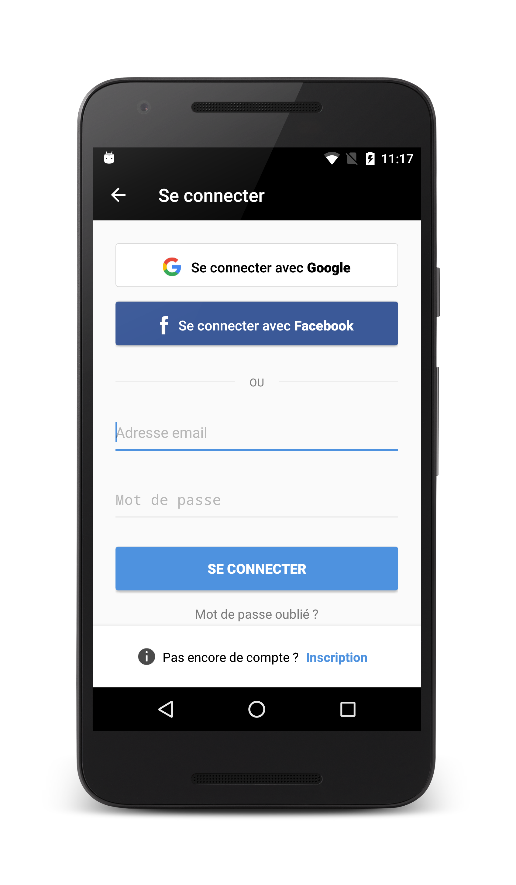
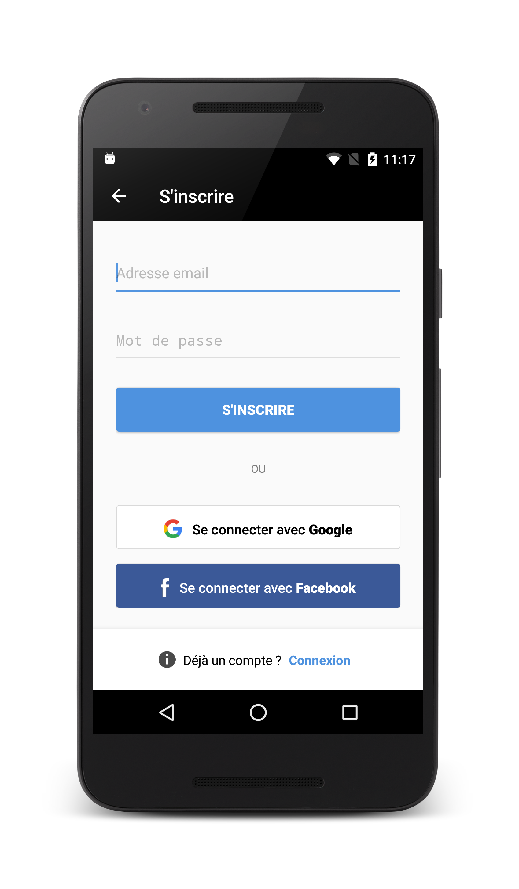

# Register module
[](https://jitpack.io/#wopata/wopata-registration-mod-android)
[](https://android-arsenal.com/api?level=16)
[](https://github.com/wopata/wopata-registration-mod-android/blob/master/LICENSE)

This module provides a fully integrated registration workflow, with designed screens with a few branding elements to fit your needs. It is split in two modules :

* A `core` module that leverages both Facebook and Google social connect
* A `ui` module that depends on `core` but also provides screens, and notifies back to your own application whether a user attempts to sign in/sign up/reset password.

The idea is to avoid duplicating the registration process by letting you focus on what to do when a user actually registers to your application.

A [sequence](docs/workflow.graphml) diagram explains how the library behaves.

Landing | SignIn | SignUp
---- | ---- | ----
 |  | 

## Gradle Dependency

Add this in your root `build.gradle` file:

```groovy
allprojects {
	repositories {
		// ... other repositories
		maven { url "https://jitpack.io" }
	}
}
```

Then add the following dependency in your project.

```groovy
def register_version = "{latest_version}"

dependencies {
  	compile "com.github.wopata.wopata-registration-mod-android:core:$register_version"

	// or if you want the already integrated workflow with designed screens, rather use the following dependency
	compile "com.github.wopata.wopata-registration-mod-android:ui:$register_version"
}
```

## Getting started

Assuming that you want the whole package, you will need to indicate how your application must behave on each actions that this library provides. Add the following lines in your calling `Activity` :

```kotlin

override fun onCreate(savedInstanceState: Bundle?) {
	super.onCreate(savedInstanceState)
	setContentView(R.layout.<your_layout>)

	RegisterManager.signIn = { activity, user ->
	    // request sign in to server by sending provided user
	}
	RegisterManager.signUp = { activity, user ->
	    // request sign up to server by sending provided user
	}
	RegisterManager.reset = { activity, user ->
	    // request password to server
	}
}

```

To start the registration workflow, call the `LoginActivity` :

```kotlin
startActivity(Intent(this, LoginActivity::class.java))
```

To come back to your activity once your user registers, you can call the `finish` method by giving it your calling activity to pop back to it and end all activities from the library :

```kotlin
RegisterManager.finish(this)
```

## Customization

Although this library is rather limited in terms of customization (this is expected as we want to provide a workflow "as is" and let you implement a registration process in no time) you can still customize a few parameters, especially on the landing screen that you can see while starting the registration workflow using the `ConfigurationManager` :

```kotlin
val configuration = ConfigurationManager.sharedInstance(this)
configuration.landingBackground = <your_drawable_in_full_page>
configuration.landingBrand = <your_logo>
configuration.landingBrandMargin = <your_logo_margins>
configuration.landingText = <your_text_to_attract_your_users_to_register>
configuration.landingTextFont = <your_font_for_your_text_to_attract_your_users_to_register>
configuration.ctaBackground = <your_call_to_action_background>
configuration.ctaTextColor = <your_call_to_action_text_color>
configuration.ctaTextFont = <your_call_to_action_text_font>
```

By default, all social connects are disabled, only native authentication is available. If you want to activate either Facebook or Google connect, add them to the configuration sources :

```kotlin
val configuration = ConfigurationManager.sharedInstance(this)
configuration.sources = arrayOf(RegisterSource.NATIVE, RegisterSource.FACEBOOK, RegisterSource.GOOGLE)
```

## Configure your application for Facebook

Create or select your Facebook application on [Facebook for developer](https://developers.facebook.com/docs/facebook-login/android). Retrieve your `facebook_app_id` and go to your *AndroidManifest.xml* file :

```xml
<uses-permission android:name="android.permission.INTERNET" />

<application ...>

	 <activity
		android:name="com.facebook.FacebookActivity"
		android:configChanges="keyboard|keyboardHidden|screenLayout|screenSize|orientation"
		android:label="@string/app_name" />

	 <meta-data
		android:name="com.facebook.sdk.ApplicationId"
		android:value="@string/facebook_app_id" />

</application>
```

 You may also enable the Custom tab to leverage Facebook connect through the Chrome plugin (the login protocol scheme can also be found from the Facebook developer page) :

```xml
<application ...>

	<activity
		 android:name="com.facebook.CustomTabActivity"
		 android:exported="true">
		 <intent-filter>
			<action android:name="android.intent.action.VIEW" />

			<category android:name="android.intent.category.DEFAULT" />
			<category android:name="android.intent.category.BROWSABLE" />

			<data android:scheme="@string/fb_login_protocol_scheme" />
		 </intent-filter>
	</activity>

</application>
```

By default, the Facebook connect asks for the `public_profile` permission but this can be changed using :

```kotlin
RegisterManager.facebookPermissions = arrayListOf("public_profile, email, etc.")
```

## Configure your application for Google

In your root `build.gradle`, add the following line :

```groovy
buildscript {
    repositories {
        jcenter()
    }
    dependencies {
    	...
      	classpath 'com.google.gms:google-services:3.1.0' // Add this
    }
}
```

Then in your app `build.gradle`, add the following lines :

```groovy
dependencies {
    ...
    compile 'com.google.android.gms:play-services-auth:11.0.2' // Add this (note that this should not be required as this dependency is already declared in `core` but Dex shows a conflict without it)
}

apply plugin: 'com.google.gms.google-services' // Add this
```

You will need to create an application from the developer console. More information can be found in this [documentation](https://developers.google.com/identity/sign-in/android/start-integrating).

Once you have setup your Google application, download your `google-services.json` file and include it in your `app` project.

Finally, in order to retrieve your web token that can be safely shared to your own server, you must provide a `googleTokenId` that can be found inside your project in the developer console. The last section of this [document](https://android-developers.googleblog.com/2016/03/registering-oauth-clients-for-google.html) explains to you how to retrieve this web token. Indicate this token with the following lines :

```kotlin
RegisterManager.googleIdToken = <your_web_token>
```

## Create your own register screen workflow

You may want to create your own screens to manage your registration process. You can still use this library using the `core` module and let it handle either Facebook or Google connect.

When you want to trigger such a connection, just call :

```kotlin
RegisterManager.login(this, RegisterSource.GOOGLE /* or RegisterSource.FACEBOOK */)
```

Note that an exception will be thrown whether :

* you don't provide any permission for Facebook
* you don't provide a web token for Google
* you pass RegisterSource.NATIVE as source parameter as there is no value using this method as you will handle your own registration process.

Finally you must override your calling activity's `onActivityResult` to propagate the social connect handling to the library :

```kotlin
override fun onActivityResult(requestCode: Int, resultCode: Int, data: Intent?) {
    super.onActivityResult(requestCode, resultCode, data)
    RegisterManager.handleResult(this, requestCode, resultCode, data)
}
```

## Pull requests

I welcome and encourage all pull requests. I might not be able to respond as fast as I would want to but I endeavor to be as responsive as possible.

All PR must:

1. Be written in Kotlin
2. Maintain code style
3. Indicate whether it is a enhancement, bug fix or anything else
4. Provide a clear description of what your PR brings
5. Enjoy coding in Kotlin :)
